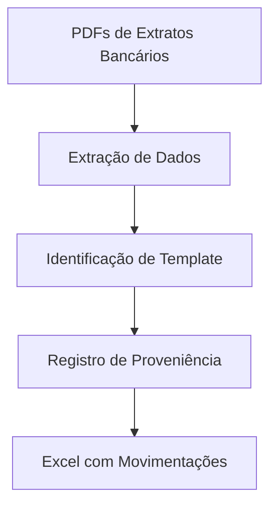

# 📄 Extração de Extratos Bancários

Projeto de ETL para processamento de extratos bancários em PDF, realizando a extração de dados, identificação automática de templates e registro de proveniência para garantir rastreabilidade, auditabilidade e suporte a análises posteriores.

## 🎯 Objetivo

O objetivo deste projeto é automatizar a leitura de extratos bancários disponibilizados publicamente na internet, transformando documentos PDF em dados estruturados para análise.

O processo contempla:

* Extração de informações dos extratos bancários;
* Identificação automática do banco e do template utilizado;
* Padronização das movimentações financeiras;
* Registro de proveniência dos dados em SQLite;
* Geração de arquivos estruturados para consumo e auditoria.

---

## 🔄 Fluxo do Projeto



### Entrada (Input)

* Arquivos PDF contendo extratos bancários.

### Saída (Output)

* Arquivos Excel contendo as movimentações extraídas e estruturadas.

---

## 📁 Estrutura do Projeto

```text
.
├── DATA
│   ├── INPUT/
│   │   └── Arquivos PDF
│   └── OUTPUT/
│       └── Excel com movimentações
│
├── DOCS
│   └── SUPERPOWERS
│       ├── plans/
│       │   └── Plano de implementação da proveniência em SQLite
│       └── specs/
│           └── Correção de caminhos relativos no escopo da especificação
│
├── SRC
│   ├── banks/
│   │   └── Templates e regras específicas de cada banco
│   │
│   ├── core/
│   │   ├── error_excel.py
│   │   │   └── Registro de erros em planilhas Excel
│   │   │
│   │   ├── extract_data.py
│   │   │   └── Extração dos dados dos PDFs
│   │   │
│   │   ├── identificador_template.py
│   │   │   └── Identificação automática dos templates bancários
│   │   │
│   │   └── proveniencia.py
│   │       └── Registro e validação da proveniência dos dados
│   │
│   └── main.py
│       └── Orquestração completa do ETL
│
├── TESTS
│   ├── conftest.py
│   │   └── Schema SQLite utilizado nos testes de proveniência
│   │
│   ├── test_extract_pdfs_proveniencia.py
│   │   └── Registro e validação do resumo de proveniência por PDF
│   │
│   └── test_proveniencia.py
│       └── Testes da camada de proveniência
│
├── .gitignore
├── README.md
└── requirements-dev.txt
```

---

## 🚀 Funcionalidades

* Extração automatizada de extratos bancários em PDF;
* Suporte a múltiplos bancos e templates;
* Identificação automática do layout do documento;
* Registro de proveniência dos dados processados;
* Geração de planilhas Excel padronizadas;
* Tratamento e registro centralizado de erros;
* Testes automatizados para validação do processamento.

---

## 🛠️ Tecnologias Utilizadas

* Python
* SQLite
* Pandas
* OpenPyXL
* Pytest

---

## 📊 Proveniência dos Dados

O projeto implementa mecanismos de rastreabilidade para registrar:

* Arquivo de origem processado;
* Banco identificado;
* Template utilizado;
* Quantidade de registros extraídos;
* Status do processamento;
* Logs de auditoria.

Essas informações permitem acompanhar todo o ciclo de vida dos dados extraídos, facilitando validações, auditorias e análises futuras.

---

## ▶️ Como Executar

### 1. Instale as dependências

```bash
pip install -r requirements-dev.txt
```

### 2. Adicione os PDFs

Coloque os arquivos PDF na pasta:

```text
DATA/INPUT
```

### 3. Execute o pipeline

```bash
python src/main.py
```

### 4. Consulte os resultados

Os arquivos processados estarão disponíveis em:

```text
DATA/OUTPUT
```

---

## 🧪 Executando os Testes

```bash
pytest tests/
```

---

## 👥 Autores

**João Pedro La Porta Balaciano**

**Luiz Felipe Vila Alves Verde**
